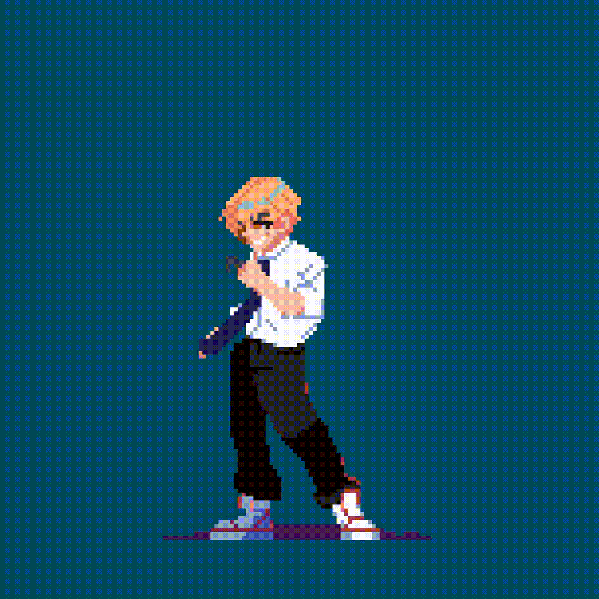

<h1 align="center">💫 Hi👋, It's Your Sreejon</h1>
A Passionate Gamer 🎮 || So-Called Engineer 🧑🏻‍🔬 || Real Audiophile 🎧

Email Me 👉 📩📫 **mondalsreejon7@gmail.com** For Collaboration/Project or Anything Else. 😊😊

<table>
<tr>
<td width="320">

</td>

<td>

- 🔭 **I’m currently working on:** Plant-Health-Check 🌱  
- 🌱 **I’m currently learning:** Everything 🧩  
- 🤔 **I’m looking for help with:** My Life 🤧  
- 💬 **Ask me about:** Collaboration, Tech Support  
- 😄 **Pronouns:** Sreejon  
- ⚡ **Fun fact:** I Love Tech and Tech Love Me 🧑🏻‍💻  

</td>
</tr>
</table>

## 🌐 Socials:
            

  

# 💻 Tech Stack:
                                                      
# 📊 GitHub Stats:

## 🏆 GitHub Trophies

### ✍️ Random Dev Quote

### 🔝 Top Contributed Repo

  ## 💰 You can help me by Donating
   

  
<!-- Proudly created with GPRM ( https://gprm.itsvg.in ) -->
